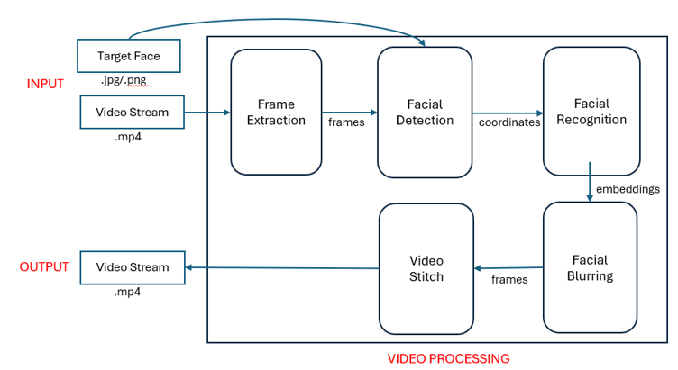
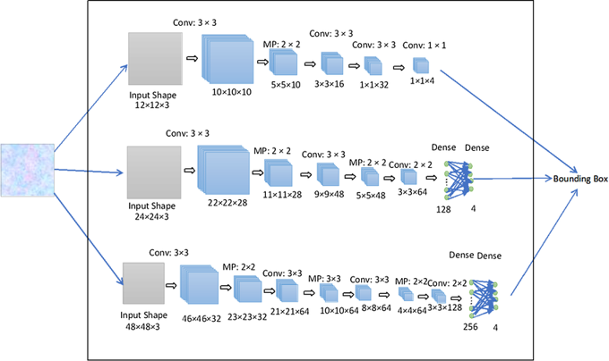
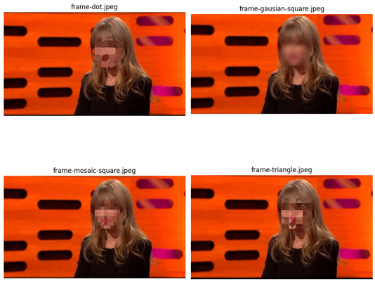
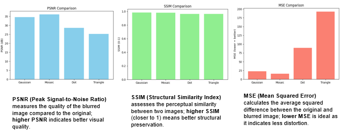

# Intelligent Video Anonymization

### Selective Face Detection • Recognition • Privacy-Preserving Video Processing

<p align="left">
  
  
  
  
  
</p>

<p align="left">
  <b>Automatically detect, identify and anonymize a selected person in a multi-person video while preserving the rest of the scene.</b>
</p>

---

## Project Overview

**Intelligent Video Anonymization** is a computer-vision pipeline for targeted face anonymization.

The system takes:

1. A video containing multiple individuals.
2. A reference image of the person whose face should be anonymized.

The video is processed frame by frame. Faces are detected using **MTCNN**, detected faces are compared with the reference using **FaceNet embeddings**, and only the matching face is anonymized.

The project presentation describes the core flow as **face detection → face recognition → selective blurring → output video**.

> **Core idea:** Instead of anonymizing every detected face, identify the specific person represented by a reference image and anonymize only that individual.

---

## System Architecture

<p align="center">
  
</p>

---

## Methodology

### 1. Reference Image

A reference image containing the target person's face is supplied to the system.

### 2. Face Detection

Each video frame is passed through **MTCNN (Multi-task Cascaded Convolutional Networks)** to detect faces.

The detector provides bounding boxes for the faces present in the frame.

<p align="center">
  
</p>

### 3. Face Recognition

The detected faces are converted into embeddings using **FaceNet / InceptionResnetV1**.

The reference face is also converted into an embedding.

### 4. Identity Matching

The implementation compares embeddings using cosine similarity:

$$
S(x,y)=\frac{x\cdot y}{\|x\|\|y\|}
$$

A configurable threshold determines whether the detected face is considered the target.

The default implementation threshold is **0.90**. This is a project configuration value and should be tuned using validation data for a particular dataset.

### 5. Selective Anonymization

If the detected face matches the reference identity, only that face region is passed to the selected blur operation.

Other people in the frame remain unchanged.

### 6. Video Reconstruction

OpenCV writes the processed frames into a new output video.

---

## Blur Techniques

The project supports four blur strategies:

  | Technique | Description |
  |---|---|
  | **Gaussian** | Smooth Gaussian filtering for strong face anonymization |
  | **Mosaic** | Pixelation through downsampling and nearest-neighbor reconstruction |
  | **Dot** | Custom circular/dot-shaped filtering kernel |
  | **Triangle** | Custom triangular weighted filtering kernel |

The project presentation specifically evaluates **Gaussian, Mosaic, Dot and Triangle** blur techniques.

<p align="center">
  
</p>

---

## 📊 Evaluation

The project evaluates both **visual quality** and **blur strength**.

### Image Quality Metrics

#### PSNR — Peak Signal-to-Noise Ratio

PSNR measures the quality of the processed image relative to the original.

$$
PSNR = 10\log_{10}\left(\frac{MAX_I^2}{MSE}\right)
$$

Higher PSNR generally indicates lower pixel-level distortion.

#### SSIM — Structural Similarity Index

SSIM measures perceptual and structural similarity between images.

Values closer to **1** indicate stronger structural similarity.

#### MSE — Mean Squared Error

$$
MSE=\frac{1}{MN}\sum (I-K)^2
$$

Lower MSE indicates less pixel-level error.

### Blur-Strength Metrics

The project also evaluates:

- **Laplacian Variance**
- **Tenengrad**
- **Brenner**

These are sharpness/focus measures. Lower values indicate a more blurred image.

<p align="center">
  
</p>

---

## Findings From the Project Evaluation

According to the project evaluation:

- **Gaussian Blur** produced the strongest anonymization according to the blur-strength measurements.
- **Mosaic Blur** provided strong visual-quality retention, with better PSNR/MSE behavior in the reported comparison.
- **Triangle Blur** provided moderate blur but showed higher distortion according to MSE.
- **Dot Blur** produced the weakest blur strength and was therefore less suitable for anonymization.

The overall project conclusion is:

> **Gaussian Blur is the strongest choice for anonymization, while Mosaic Blur provides a useful balance between anonymization and visual-quality retention.**

---

## Installation

### 1. Clone the repository

```bash
git clone https://github.com/<YOUR_USERNAME>/intelligent-video-anonymization.git
cd intelligent-video-anonymization
```

### 2. Create a virtual environment

Windows:

```bash
python -m venv .venv
.venv\Scripts\activate
```

Linux/macOS:

```bash
python3 -m venv .venv
source .venv/bin/activate
```

### 3. Install dependencies

```bash
pip install -r requirements.txt
```

For a CUDA-enabled PyTorch installation, install the appropriate PyTorch build for your CUDA version before running the project.

---

## Quick Start

Place your files like this:

```text
data/
├── input/
│   └── input_video.mp4
│
└── reference/
    └── target_face.jpg
```

Run:

```bash
python scripts/run_anonymisation.py ^
    --video data/input/input_video.mp4 ^
    --reference data/reference/target_face.jpg ^
    --output data/output/anonymised.mp4
```

On Linux/macOS:

```bash
python scripts/run_anonymisation.py     --video data/input/input_video.mp4     --reference data/reference/target_face.jpg     --output data/output/anonymised.mp4
```

---

## Change the Blur Method

### Gaussian

```bash
python scripts/run_anonymisation.py     --video data/input/input_video.mp4     --reference data/reference/target_face.jpg     --output data/output/gaussian.mp4     --blur gaussian
```

### Mosaic

```bash
python scripts/run_anonymisation.py     --video data/input/input_video.mp4     --reference data/reference/target_face.jpg     --output data/output/mosaic.mp4     --blur mosaic
```

### Dot

```bash
python scripts/run_anonymisation.py     --video data/input/input_video.mp4     --reference data/reference/target_face.jpg     --output data/output/dot.mp4     --blur dot
```

### Triangle

```bash
python scripts/run_anonymisation.py     --video data/input/input_video.mp4     --reference data/reference/target_face.jpg     --output data/output/triangle.mp4     --blur triangle
```

---

## Tune Face Matching

The default similarity threshold is `0.90`.

You can change it:

```bash
python scripts/run_anonymisation.py     --video data/input/input_video.mp4     --reference data/reference/target_face.jpg     --output data/output/anonymised.mp4     --threshold 0.85
```

A lower threshold can increase matches but may also increase false positives. A higher threshold is more selective but can miss the target under difficult conditions.

For a formal experiment, select the threshold using validation data rather than changing it only to improve one sample.

---

## Evaluate the Processed Video

After generating the anonymized video:

```bash
python scripts/evaluate_video.py     --original data/input/input_video.mp4     --processed data/output/anonymised.mp4
```

The metrics are saved to:

```text
results/metrics/video_metrics.json
```

To evaluate fewer frames:

```bash
python scripts/evaluate_video.py     --original data/input/input_video.mp4     --processed data/output/anonymised.mp4     --sample-every 30
```

---

## Compare Blur Techniques

Prepare a representative image or face crop:

```text
assets/face-sample.png
```

Then run:

```bash
python scripts/compare_blurs.py     --image assets/face-sample.png
```

The generated files will be placed under:

```text
results/blur_comparison/
```

Including:

```text
gaussian.png
mosaic.png
dot.png
triangle.png
metrics.json
```

---

## Generate Metric Plots

Run:

```bash
python scripts/plot_metrics.py
```

Plots are generated under:

```text
results/blur_comparison/plots/
```

